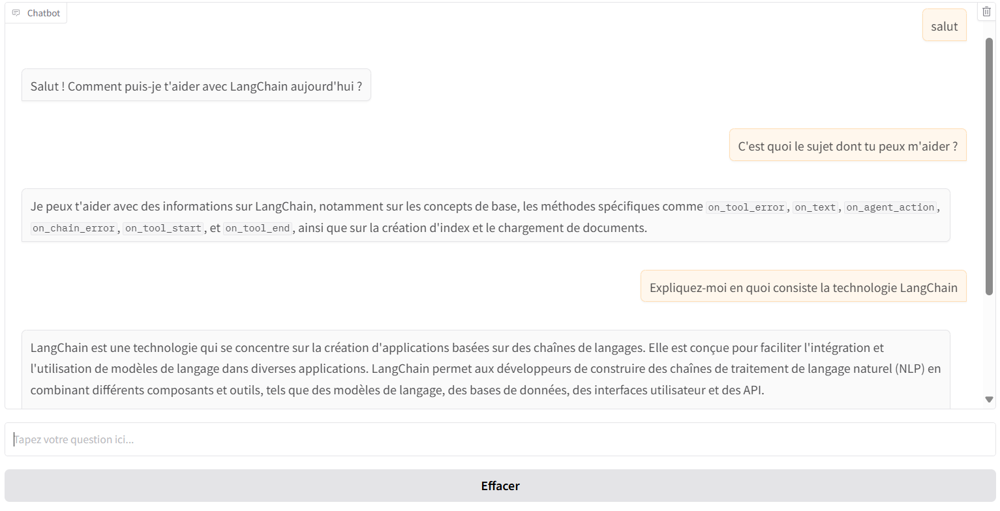

# Rapport sur le Chatbot RAG

## Difficultés rencontrées

*   **Gestion de la taille des chunks :** Trouver la taille de chunk optimale pour équilibrer la pertinence et la performance a été un défi.
*   **Qualité des données :** La qualité des données dans le corpus a un impact direct sur la pertinence des réponses.

## Améliorations possibles

*   **Optimisation du prompt :**  Améliorer le prompt fourni au LLM peut améliorer la qualité des réponses.
*   **Filtrage des résultats de la recherche vectorielle :**  Mettre en place un système de filtrage pour éliminer les résultats non pertinents de la recherche vectorielle.
*   **Utilisation d'un LLM plus performant :**  L'utilisation d'un modèle de langage plus grand et plus performant pourrait améliorer la qualité et la cohérence des réponses.
*   **Implémentation d'un système d'évaluation plus robuste :** Ajouter des métriques d'évaluation pour mesurer la performance du chatbot.

## Conclusion

Le chatbot RAG implémenté fournit une base solide pour répondre aux questions sur un corpus de données techniques. Les améliorations proposées pourraient améliorer considérablement la qualité et la performance du chatbot.

